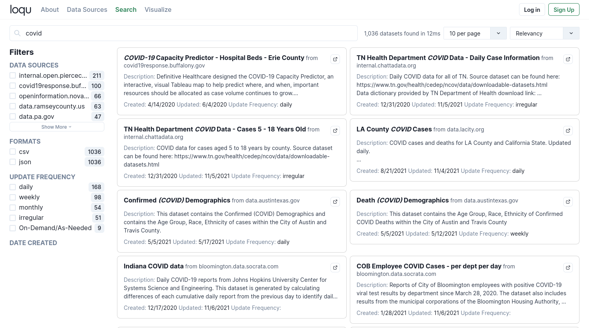
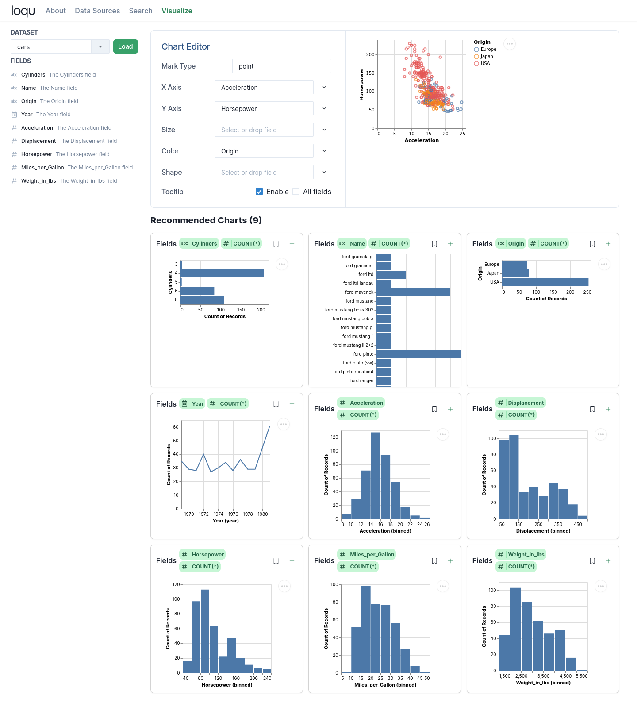

# Loqu Frontend

[Loqu](https://loqudata.org/) is an open source tool for data exploration and visualization on open datasets.

You can learn more on the homepage, [About page](https://github.com/loqudata/docs) or by [reading the paper](https://alexkreidler.github.io/loqu-paper/).

## Screenshots

## License

The source code is available under the Apache 2.0 License. Data is available under the Open Database License.
